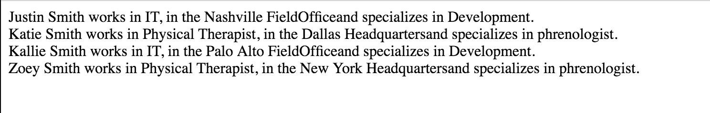

#Prototypal Inheritance


## Description
This is a introduction to [Prototypal Inheritance](https://developer.mozilla.org/en-US/docs/Web/JavaScript/Inheritance_and_the_prototype_chain)


## How to run
In your terminal run the following commands:
<br />
Navigate to the lib folder in your terminal and type:
```
npm install
```
This will install all of the dependencies for the project.
<br />
Next type the following:
```
cd ..
```
This will move you back to the root folder of the project.
<br />
Next type the following:
```
http-server -p 9999
```
Then navigate to http://localhost:9999 in your browser and open (inspector) in chrome and navigator to the "Console" tab to view the answer.

## Screenshot


## Contributors
- [Justin Leggett](https://github.com/justinal64)